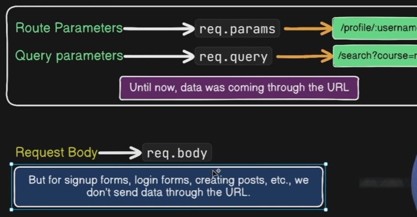

Node Modules:

1. `http` module use toc reate server in nodejs

- User defined modules
    -  To export module we need to use `module.exports = {func..}`

### Expressjs

- 

- 
- 
- 
- Route parameters can used in channel/profile dashboard cases
- Query parameters can be used in filtering/searching of data
- 
- `express.json()` is middleware in Express that parses incoming JSON data from the request body and makes it available as `request.body`
- `cors()` is Express middleware that enables Cross-Origin Resource Sharing (CORS). It allows your backend to accept requests from a different origin (domain, port, or protocol).

- Why is it needed?
- Suppose:
- Frontend: http://localhost:3000
- Backend: http://localhost:5000
- If the frontend tries to call the backend:
```
fetch("http://localhost:5000/users")
```
- The browser blocks the request by default because the origins are different.
- You'll see an error like:
- Access to fetch at 'http://localhost:5000' from origin 'http://localhost:3000' has been blocked by CORS policy.

- To allow it, use the cors middleware.
```
Install
npm install cors
```
